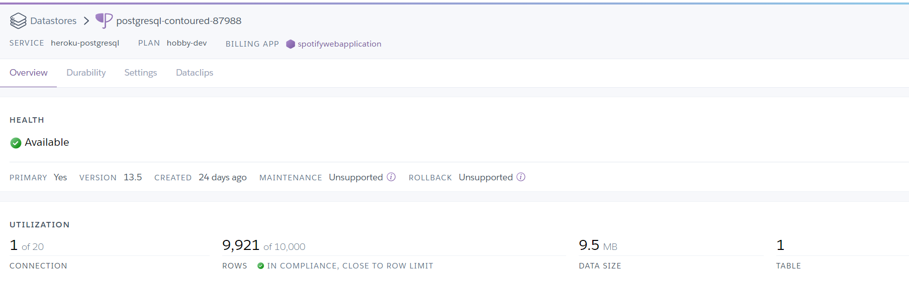

# Signature-based Virus Detector Using Java and PostgreSQL
## Eliyas Sala

## Description
* This research-based project (from Operating Systems course) implements a signature-based model to scan for viruses. Basically, it computes the MD5 hashing of every file in a given directory. If it matches the viral characteristics in the database, then it is a hazard. This application is fairly simple but complexity can further be developed by incorporating the different detection systems that exist. The tools I used are below:
    * Java(Swing API for designing the GUI, Event/Action listeners to user button clicks)
    * Postgres Driver for insertion of dataset(Virusshare.com) from java class into a remote database
    * Heroku's PostgreSQL database 
* The folder "Executable Application" contains the JAR application for you to open and test. 
* Make sure you have an internet connection, if not it will display an error message and exit the program.

* When you run it correctly, it will prompt you to choose a directory path to search for viruses. 

* Then, you click "Scan" button to scan for viruses in that directory. I have attached test cases in the "Dummy Files" folder containing a virus-infected batch script. Note: please do not open that file since it will crash your computer :)

* If the selected path is safe, the status will return clean.

### Heroku and Database connection
* Make sure the String formatting for <b>dbURL</b> is:
"jdbc:postgresql://Host:Port/Database"

* I used Heroku's free  add-on to access PostgreSQL database. Although my application currently recognizes around 10,000 viruses due to financial limitations, it is fully scalable for the future when more data is available and no database restrictions exist. 

* I performed creation and insertion using "Keys.java" and "Database_Setup.java" classes. I import connection from Keys.java to hide credentials. 
 
 * I love this project because I was able to turn my ideas into code!

